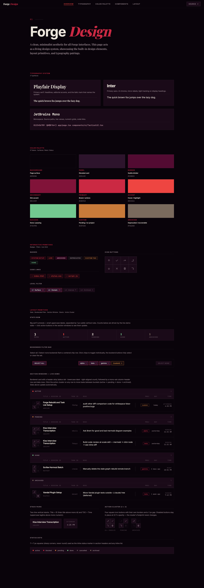

# ForgeDesign

A static HTML + CSS design showcase for **Forge** — typography, color tokens,
primitive components, and full layout patterns in one page. Open `index.html`
in a browser; no build step.

> **Building a UI in the Forge aesthetic?** Start from
> [`AGENT.md`](./AGENT.md) — it's the build guide for AI agents (and humans).



## Sections

| Section | Screenshot |
|---|---|
| Typography (3 typefaces, strict roles) | [`screenshots/typography.png`](./screenshots/typography.png) |
| Color palette (10 tokens, 4×2 grid) | [`screenshots/colors.png`](./screenshots/colors.png) |
| Components (badges, filters, icon grid) | [`screenshots/components.png`](./screenshots/components.png) |
| Layout primitives (stats / filter / windows / clusters / dots) | [`screenshots/layout.png`](./screenshots/layout.png) |
| Section windows (live demo, 4 buckets) | [`screenshots/section-windows.png`](./screenshots/section-windows.png) |
| 2×2 action clusters (state matrix) | [`screenshots/action-cluster.png`](./screenshots/action-cluster.png) |

## Stack

Plain HTML, CSS, and ~220 lines of vanilla JS. Fonts pulled from Google Fonts.
No frameworks, no bundler, no runtime dependencies. `npm` is used only for the
screenshot tool.

## Design language

- **Typography:** Inter (UI, body, titles, hero h1), JetBrains Mono (IDs,
  hashes, timestamps, uppercase eyebrow labels), Playfair Display
  (large serif numerals + italic 800 wordmark accent only).
- **Surfaces:** sharp corners everywhere (no `border-radius`), thin 1 px
  borders, no shadows, no gradients.
- **Animations:** windowed slide transitions on `cubic-bezier(0.4, 0, 0.2, 1)`.
- **Palette:** 10-token red / plum / status system (canonical values in
  [`styles.css :root`](./styles.css)):

  | token | hex | role |
  |---|---|---|
  | `--bg-base`           | `#09030a` | page background |
  | `--bg-card`           | `#1a0a18` | header strips, chip surface |
  | `--bg-elev`           | `#2D142C` | hover fill |
  | `--accent-red`        | `#CB2943` | primary, project pill |
  | `--accent-red-bright` | `#EE4541` | active status, hover stroke |
  | `--accent-red-dim`    | `#811339` | secondary outlines |
  | `--accent-red-deep`   | `#530B32` | danger fill (purge hover) |
  | `--accent-green`      | `#73C990` | done / success |
  | `--accent-orange`     | `#C87A3A` | pending / custom / no-project |
  | `--accent-grey`       | `#7a6a5d` | archived (recoverable) |
  | `--text-main/dim/mute` | `#ece6dc / #9b8a92 / #5a4a55` | text tiers |

Inspired by [DitherTemplate](https://github.com/pranavgupta55/DitherTemplate)
and the Scribe / Tasks dashboards.

## Files

```
index.html      single-page showcase
styles.css      design tokens + components
script.js       nav scroll-spy, filter-bar sync, live demo state machine
AGENT.md        build guide for AI agents (read first if cloning the look)
tools/          Playwright-based screenshot capture
screenshots/    PNGs generated from index.html (do not hand-edit)
```

## Regenerating screenshots

The PNGs under `screenshots/` are produced by Playwright against the live
HTML. Always re-run after a visual change so the README stays in sync:

```sh
npm install            # one-time — installs Playwright + Chromium
npm run screenshots    # writes 11 PNGs into screenshots/
```

Enforced by CI: `.github/workflows/screenshots.yml` regenerates screenshots
on every push/PR that touches the rendered files and fails the build if
the committed PNGs don't match. The freshly-rendered PNGs are uploaded as
an artifact when CI fails, so contributors can download them straight onto
the branch if they forgot to re-run locally. **Don't merge with a red
screenshot job.**
